# Welcome to VBA Training

Power by Will Ran

  
    Learn more <carbon:arrow-right class="inline"/>
  

---

# What is VBA?

  

    VBA (Visual Basic for Applications) is a programming language developed by Microsoft. It is used to automate tasks in Microsoft Office applications like 
    Excel, 
    Outlook, 
    Access, 
    Word, and PowerPoint. VBA allows users to create macros to automate repetitive tasks, manipulate data, and develop custom forms and applications.
  

  <h2>Key features include:</h2>

 
 

  
  - 📝 <strong>Automation</strong> - Enhances productivity by executing repetitive tasks.
  - 🎨 <strong>Customization</strong> - Enables the creation of custom functions and adjustments to existing features.
  - 🧑‍💻 <strong>Integration</strong> - Interacts with other applications and databases for data processing and reporting.
  - 🤹 <strong>User Forms</strong> - Allows creation of user-friendly forms for input or information display.
  

 
 

  Read more about [VBA](https://learn.microsoft.com/zh-cn/office/vba/api/overview/language-reference)

---

# Knowledge Framework

```mermaid {theme: 'default', scale: 0.5}

graph LR
B((VBA 基础知识)) --> C1[什么是 VBA]

C1 --> D11[VBA 的定义和用途]
C1 --> D12[与其他编程语言的比较]


B((VBA 基础知识)) --> C3[VBA 环境设置]
C3 --> D31[如何打开 VBA 编辑器]
C3 --> D32[了解工具栏和窗口（项目窗口、属性窗口等）]


B((VBA 基础知识)) --> C2[基础语法]

C2 --> D21[对象与属性]
C2 --> D22[基本数据类型]
C2 --> D23[变量和常量]
C2 --> D24[运算符]
C2 --> D25[控制结构]
C2 --> D26[常用函数]


D21[对象与属性] --> D211[Workbook、Worksheet、Range 等]


D22[基本数据类型] --> D221[整数、单精度、双精度、字符串]
D23[变量和常量] --> D231[变量的声明与初始化]
D24[运算符] --> D241[算术运算符、比较运算符、逻辑运算符]
D25[流程控制] --> D251[条件语句（If...Then...Else）循环（For...Next、Do...Loop）]

```

---

# Training Timeline

```mermaid

gantt
    title Schedual line
    dateFormat YYYY-MM-DD
    excludes weekends
    
    section 什么是 VBA
        Start: milestone, m1, 2024-09-02, 1d
        什么是 VBA         :a1, 2024-09-02, 1d
        
    section VBA 环境设置
        VBA 编辑器    :a2, after a1, 1d
        工具栏和窗口  :a2, after a1, 1d

    section 基础语法
        对象与属性    :a3, after a2, 1d
        基本数据类型  :a4, after a3, 1d
        变量和常量    :a5, after a3, 1d
        运算符        :a6, after a5, 1d
        流程控制      :a7, after a5, 1d
        常用函数&练习          :a8, after a7, 1d
    
    End: milestone, m2, after a8,

```

---
layout: center
class: "text-center"
---

# Q & A

---
layout: center
class: "text-center"
---

# **Thank You**
