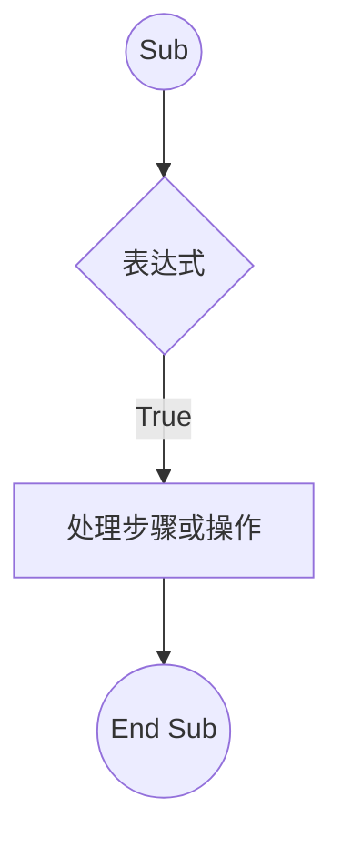
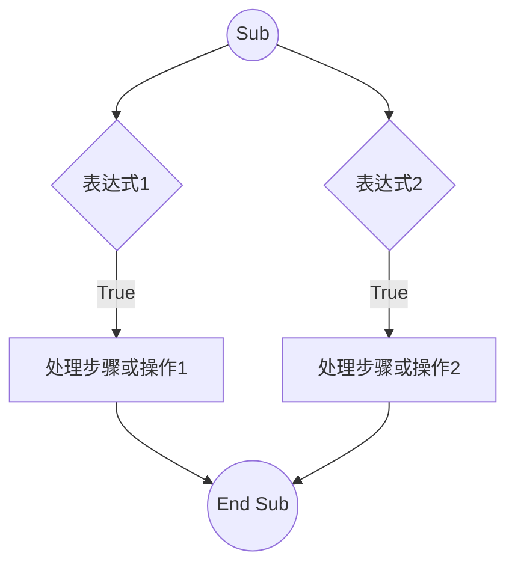
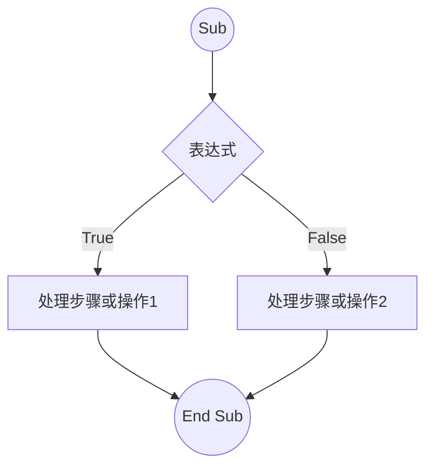
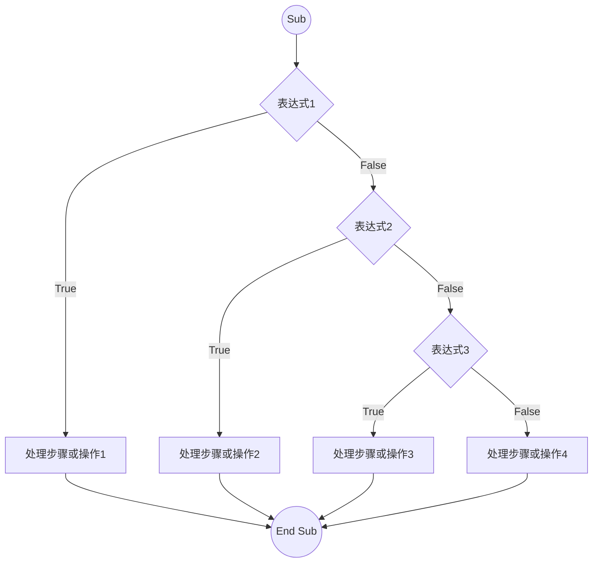
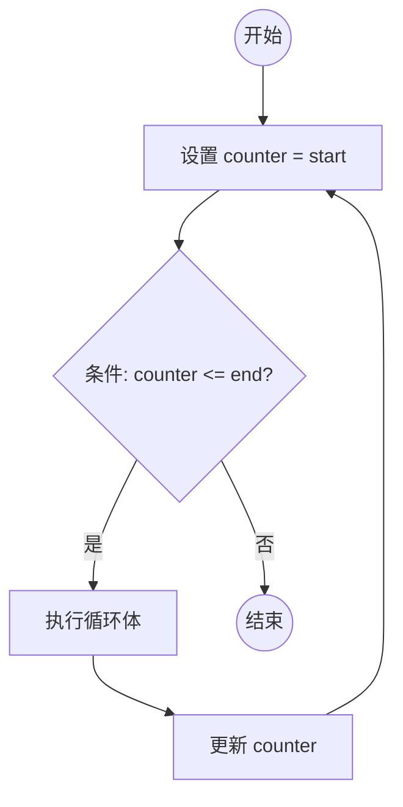
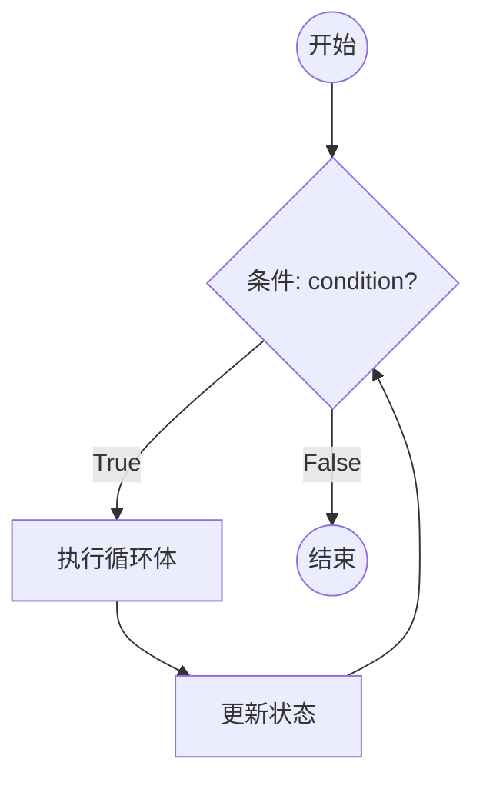
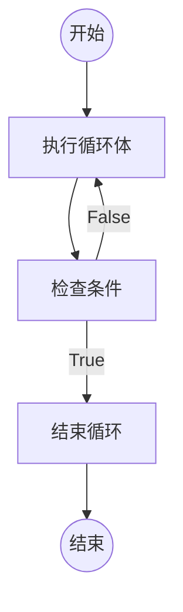

layout: two-cols
transition: view-transition
---

# If...Then 语句

<div v-click=1>



</div>

::right::

<div v-click=2>


# Code


```vb {none|none|11,13|12|all} twoslash


Sub IfTest_1（）
  If Time ＞= 0.5 Then MsgBox "下午好！"
End Sub


```

</div>

---
layout: two-cols
transition: view-transition
---

# If...Then 语句

<div v-click=1>



</div>

::right::

<div v-click=2>


# Code


```vb {none|none|11,13|12|all} twoslash


Sub SayHello（）
  If Time < 0.5 Then MsgBox "早上好！"
  If Time >= 0.5 Then MsgBox "下午好！"
End Sub


```

</div>

---
layout: two-cols
transition: view-transition
---

# If...Then...Else 语句

<div v-click=1>



</div>

::right::

<div v-click=2>


# Code


```vb {none|none|11,13|12|all} twoslash


Sub IfTest_2（）
    If Range("A1").Value = "" Then 
      MsgBox "没有输入内容"
    Else 
      MsgBox "已经输入内容"
    End If
End Sub


```

</div>


---
layout: two-cols
transition: view-transition
---

# If...Then...ElseIF 语句

<div v-click=1>



</div>

::right::

<div v-click=2>


# Code


```vb {none|none|all} twoslash


Sub ExampleIfThenElseIf()  
    Dim score As Integer  
    score = 85 ' 假设分数为 85  

    If score >= 90 Then  
        MsgBox "成绩：优秀"  
    ElseIf score >= 80 Then  
        MsgBox "成绩：良好"  
    ElseIf score >= 70 Then  
        MsgBox "成绩：中等"  
    Else  
        MsgBox "成绩：及格或不及格"  
    End If  
End Sub


```

</div>

---
layout: two-cols
transition: view-transition
---

# For...Next 语句

<div v-click=1>



</div>

::right::

<div v-click=2>


# Code


```vb {none|none|all} twoslash
Sub SumForNext()  
    Dim i As Integer  
    Dim total As Integer  
    total = 0  

    For i = 1 To 10  
        total = total + i  
    Next i  

    MsgBox "1 到 10 的总和是: " & total  
End Sub

Sub PrintUsedRangeValues()  
    Dim ws As Worksheet  
    Dim cell As Range  
    ' 设置要操作的工作表  
    Set ws = ThisWorkbook.Sheets("Sheet1") 
    For Each cell In ws.UsedRange  
        Debug.Print cell.Address & " " & cell.Value   
    Next cell  
End Sub


```

</div>


---
layout: two-cols
transition: view-transition
---

# Do While 语句

<div v-click=1>



</div>

::right::

<div v-click=2>


# Code


```vb {none|none|all} twoslash
Sub ReadDataUsingDoWhile()  
    Dim ws As Worksheet  
    Dim row As Integer  
    Dim data As String  

    ' 设置工作表  
    Set ws = ThisWorkbook.Sheets("Sheet1") 
    row = 1 ' 从第一行开始  

    ' 使用 Do While 循环读取数据  
    Do While ws.Cells(row, 1).Value <> "" '当第 1 列的值不为空时
        data = ws.Cells(row, 1).Value ' 读取当前单元格的值  
        Debug.Print "Row " & row & " value: " & data  
        row = row + 1 ' 移动到下一行  
    Loop  
End Sub


```

</div>


---
layout: two-cols
transition: view-transition
---

# Do Until 语句

<div v-click=1>



</div>

::right::

<div v-click=2>


```vb {none|none|all} twoslash
Sub ExampleDoLoopUntil()  
    Dim counter As Integer  
    counter = 1 ' 初始化计数器  

    ' 使用 Do Loop Until 循环  
    Do  
        ' 输出当前计数器的值
        Debug.Print "Counter value: " & counter   
        ' 增加计数器 
        counter = counter + 1  
        ' 当计数器超过 10 时停止循环
    Loop Until counter > 10   
    ' 显示最终计数器值
    MsgBox "循环结束，最终计数器值为: " & counter   
End Sub
Sub ExampleDoUntil()  
    Dim counter As Integer  
    counter = 1 ' 初始化计数器  
    ' 使用 Do Until 循环  
    Do Until counter > 5 ' 条件为真时停止循环  
        Debug.Print "Counter value: " & counter 
        counter = counter + 1 ' 增加计数器  
    Loop  
    MsgBox "循环结束，最终计数器值为: " & counter 
End Sub
```

</div>


---
layout: center
class: "text-center"
---


# Q & A


---
layout: center
class: "text-center"
---

# **Thank You**