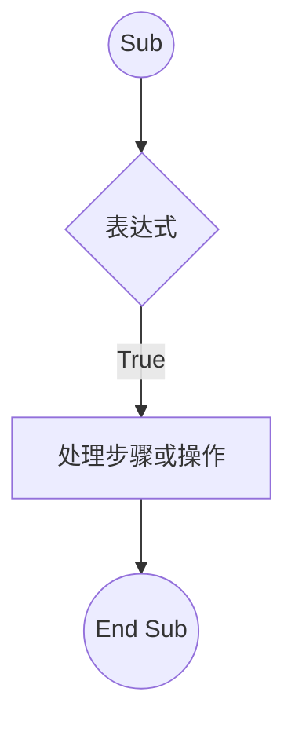
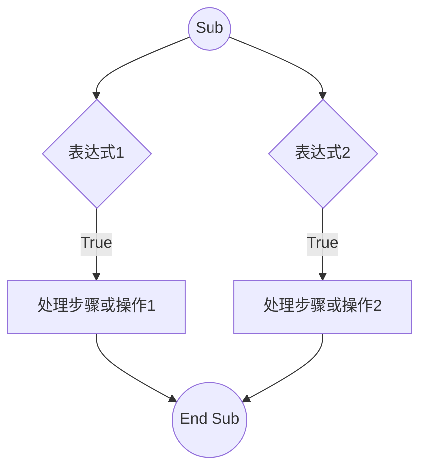
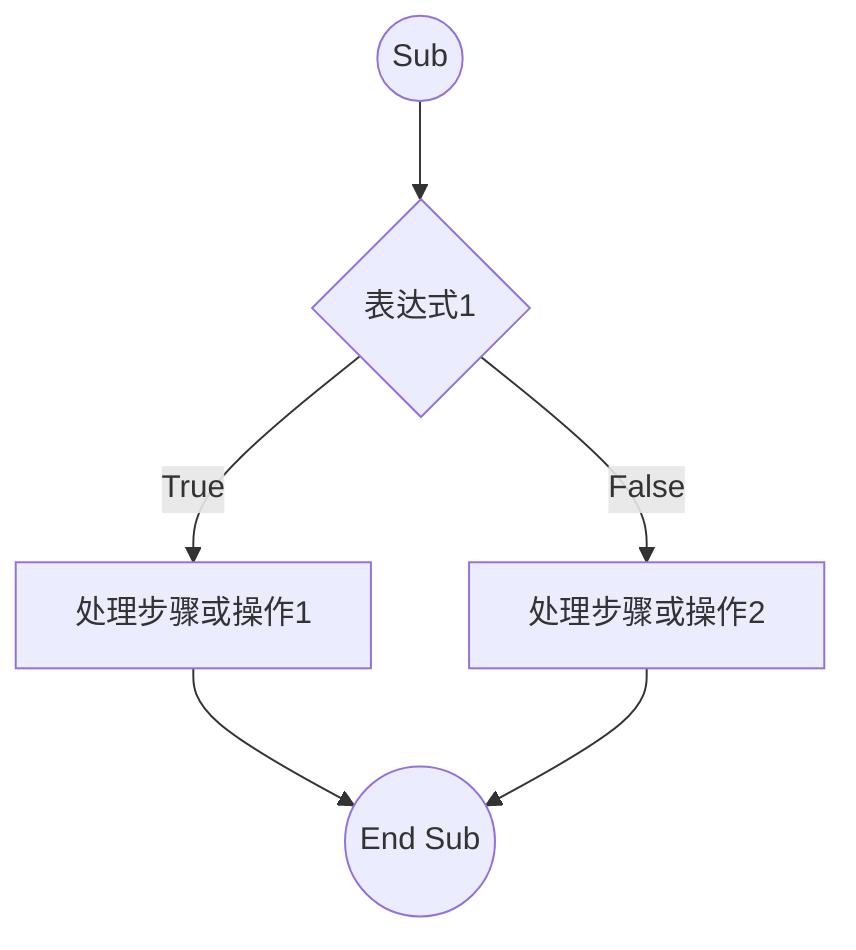

layout: two-cols
transition: view-transition
---

# If...Then语句

<div v-click=1>



</div>

::right::

<div v-click=2>


# Code


```vb {none|none|11,13|12|all} twoslash


Sub IfTest_1（）
  If Time ＞= 0.5 Then MsgBox "下午好！"
End Sub


```

</div>

---
layout: two-cols
transition: view-transition
---

# If...Then语句

<div v-click=1>



</div>

::right::

<div v-click=2>


# Code


```vb {none|none|11,13|12|all} twoslash


Sub SayHello（）
  If Time ＜ 0.5 Then MsgBox "早上好！"
  If Time ＞= 0.5 Then MsgBox "下午好！"
End Sub


```

</div>

---
layout: two-cols
transition: view-transition
---

# If...Then语句

<div v-click=1>



</div>

::right::

<div v-click=2>


# Code


```vb {none|none|11,13|12|all} twoslash


Sub IfTest_2（）
    If Range（”A1”）.Value=””Then 
      MsgBox"没有输入内容"
    Else 
      MsgBox”已经输入内容”
    End If
End Sub


```

</div>
